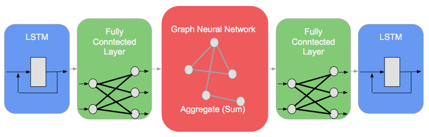
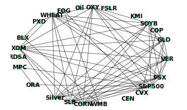
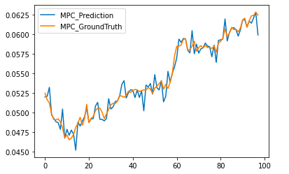
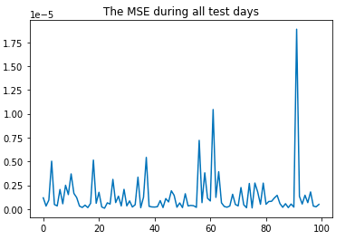

# GNN plus LSTM
The neural network as shown below is a Hybrid GNN–LSTM network providing a stock prediction.  
. 

The relation graph for Graph Neural Network is described below. The relation graph would change according to the market status.   
.          

Take MPC as an example.      
   

.  

Colab Link  
https://colab.research.google.com/drive/1K1K1r6a2hr58dNHohhLjvOSRDrf3XleA?authuser=1#scrollTo=0fZugpdeicyH.  
